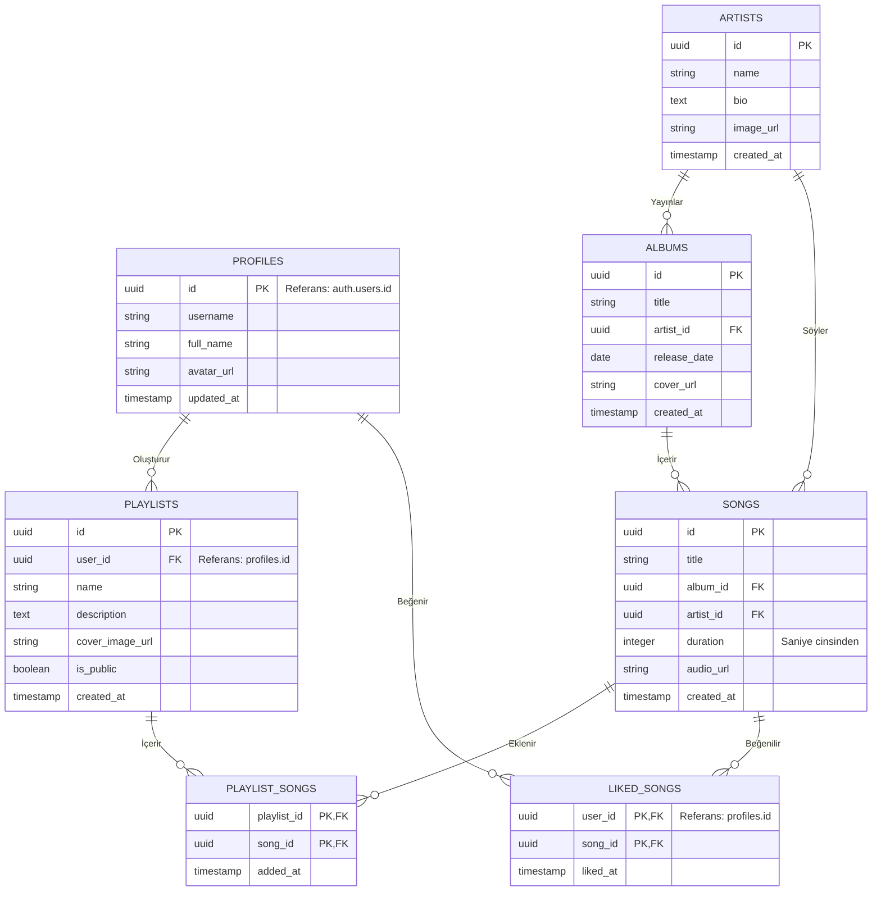

# Melodix App - Entity Relationship (ER) Diagram

Aşağıdaki diyagram, Melodix uygulamasının Supabase üzerinde kurgulanan veritabanı tablolarının birbirleriyle olan ilişkilerini (Entity-Relationship) göstermektedir.

## Tablo İlişkileri Açıklaması
- **PROFILES:** `auth.users` tablosuna (Supabase Auth) birebir bağlı kullanıcı profil bilgilerini (kullanıcı adı, avatar vb.) tutar.
- **ARTISTS & ALBUMS & SONGS:** Bir sanatçının birden çok albümü ve şarkısı olabilir. Şarkılar bir albüme bağlıdır. (Bu yapı, "Single" türündeki şarkılar için tek şarkılık albüm mantığıyla da kurgulanabilir).
- **PLAYLISTS:** `PROFILES` tablosuna bağlıdır (Kullanıcı listeleri).
- **PLAYLIST_SONGS:** Many-to-Many (Çoka çok) ilişki tablosudur. Bir çalma listesinde birden fazla şarkı olur, bir şarkı birden fazla çalma listesinde bulunabilir.
- **LIKED_SONGS:** Many-to-Many ilişki tablosudur. Hangi kullanıcının hangi şarkıyı beğendiğini asenkron tarih verisiyle saklar.
